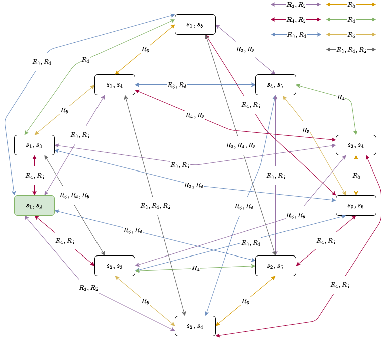
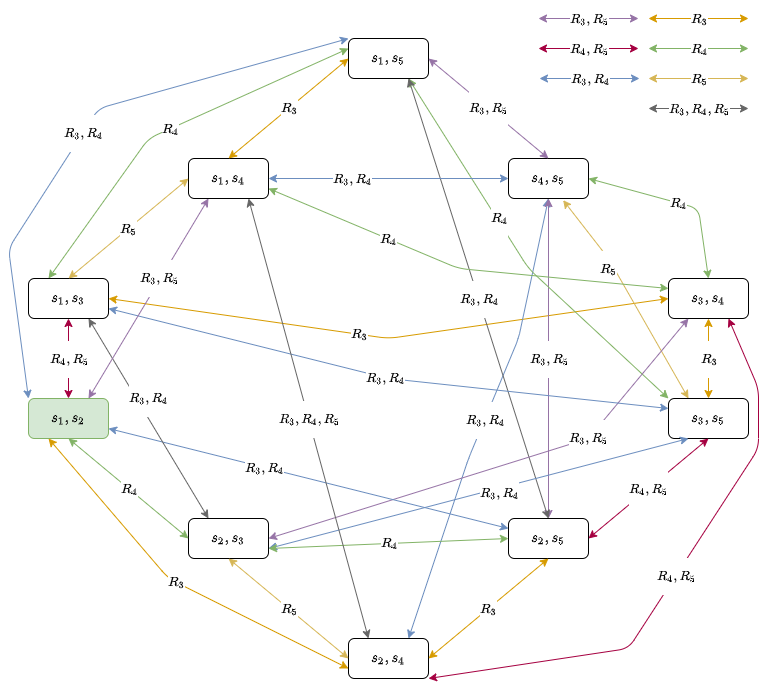

Authors: Ella Collins, Lonneke Langeveld and Ritten Roothaert. 

## Introduction

The Resistance is a multi-player deductive reasoning role-playing game designed by Don Eskridge in 2010. The players are divided into two "factions": the resistance (the "good guys") and the government spies (the "bad guys"). Within the game, players are sent on 5 missions that can either pass or fail. The resistance players aim to pass a majority of these missions, while the government spies aim to sabotage the missions. A minimum of five players are required for the game. 

At the start of a game with five players, two players are chosen at random to be spies and the other three players are the resistance. The spies know each other's identity while the resistance remains in the dark. At the start of each round, a Mission Leader is chosen who will guide the round's mission. The Mission Leader selectes a team to send on the mission, after which everyone votes on the team make-up. If the players agree, the team is sent on the mission. If the players disagree, a new player becomes the Mission Leader and the process repeats. After 5 failed attempts to create a mission team, the government spies automatically win that mission and recieve a point. 

In a mission, each person on the team place a card face-down, either a "pass"-card or a "fail"-card. Resitance players must play a "pass"-card, while spies can choose to play a "pass"-card or a "fail"-card. The resistance wins the mission if all cards played are "pass"-cards, while the spies win if at least one card played is a "fail"-card. Winning the mission gives the respective faction a point. A faction wins the game once they have received three points.

Resistance players have to try to deduce who the spies are to ensure that the spies cannot sabotage the missions. The spies have to attempt to keep their identity a secret from the resistance.

For our project, we are going to implement a multi-agent simulation based on the Resistance. We will be using higher-order knowledge and public announcements. Since the game can be rather complex, we will consider a simplified version. *insert simplifications later* Spies only play "fail"-cards ?


## Model 
We are going to model the Resistance game with the help of Dynamic Epistemic Logic. With five players we have a set of five agents A = {1,2,3,4,5}. Out of these agents, two agents are spies which we can denote by s_i meaning that agent i is a spy. The worlds of the Kripke model will consist of every combination of spy pairs, resulting in 10 initial worlds. The initial model is shown below. 

*insert initial model image here*

As the game proceeds, the model is simplified as the agents learn from the public annoucements given at the end of each misssion. 

### Example run-through 
For a game with five agents A = {1,2,3,4,5}, where agent 1 and 2 are spies, and the rest are part of the resistance, the real world is s_1s_2. Agent 1 and 2 are aware of each other's identities. This is equivalent to a private annoucement between the two agents. Therefore, they are already aware of the real state of the model. This means that there are only reflexive relation arrows for agent 1 and agent 2. The resistance agents cannot distinguish between worlds. This is illustrated in the model below.



The mission leader is chosen at random: agent 4 is the mission leader and must propose a mission team. For mission 1, two players make up the mission team. Since agent 4 has not learnt anything about the identities of the other agents, they choose two players at random for the first mission: agent 1 and agent 5. Now the other agents must use their knowledge to either vote for or against this mission team. Since none of the resistance players know of the identity of agent 1, they will vote for the mission team. Also, the spies want a spy to be on a mission, so they will vote for the mission team. Therefore, the mission team is accepted and agent 1 and agent 5 go on the mission. 

On mission 1, agent 1 plays a fail card since they are a spy, and agent 5 plays a pass card sicne they are part of the resistance. As one fail card was played, the mission failed. The spies recieve one point. This leads to the conclusion that either agent 1 is a spy or agent 5 is a spy. Therefore, the public annoucement made is [s1 V s5]

Since there are two agents that are spies and the annoucement only provides hesitant information about the identity of agent 1 and agent 5, no states are removed from the model. However, agent 5 has learned something important from the mission. They know that agent 1 played the fail card, since agent 1 was the only other agent on the mission. Therefore, agent 5 knows that agent 1 is a spy. This means that the relations for agent 5 can be updated to the model illustrated below. 



The next mission leader is chosen as the next player: agent 5. Mission 2 requires a three player team. Since agent 5 knows that agent 1 is a spy, $Ks_1$, they will not include agent 5 in the mission team. Agent 5 does not know anything about the identity of the other players, so they choose three players from the remaining randomly. The proposed team is agent 3 agent 4 and agent 5. Since agents 1 and 2 know that agents 3, 4 and 5 are all part of the resistance, they will both vote against this mission team. However, agents 3, 4 and 5 will vote for this mission as they do not know that any of the other agents in the team are spies. This leads to a majority for the mission team, so the mission goes ahead. 

On mission 2, agents 3, 4 and 5 all play a pass card as they are all part of the resistance. This means that the mission passes and the resistance receives one point. This leads to the conclusion that agent 3, agent 4 and agent 5 are not spies. Therefore, the public annoucement made is 


I think you should use an
`<addr>` element here instead.

## Theory

## Results

## Conclusion

# Running instructions


<!--- Markdown is a lightweight and easy-to-use syntax for styling your writing. It includes conventions for

```markdown
Syntax highlighted code block

# Header 1
## Header 2
### Header 3

- Bulleted
- List

1. Numbered
2. List

**Bold** and _Italic_ and `Code` text

[Link](url) and 
```

For more details see [GitHub Flavored Markdown](https://guides.github.com/features/mastering-markdown/).

### Jekyll Themes

Your Pages site will use the layout and styles from the Jekyll theme you have selected in your [repository settings](https://github.com/Ritten11/LAMAS2021/settings/pages). The name of this theme is saved in the Jekyll `_config.yml` configuration file.

### Support or Contact

Having trouble with Pages? Check out our [documentation](https://docs.github.com/categories/github-pages-basics/) or [contact support](https://support.github.com/contact) and we’ll help you sort it out.
-->
