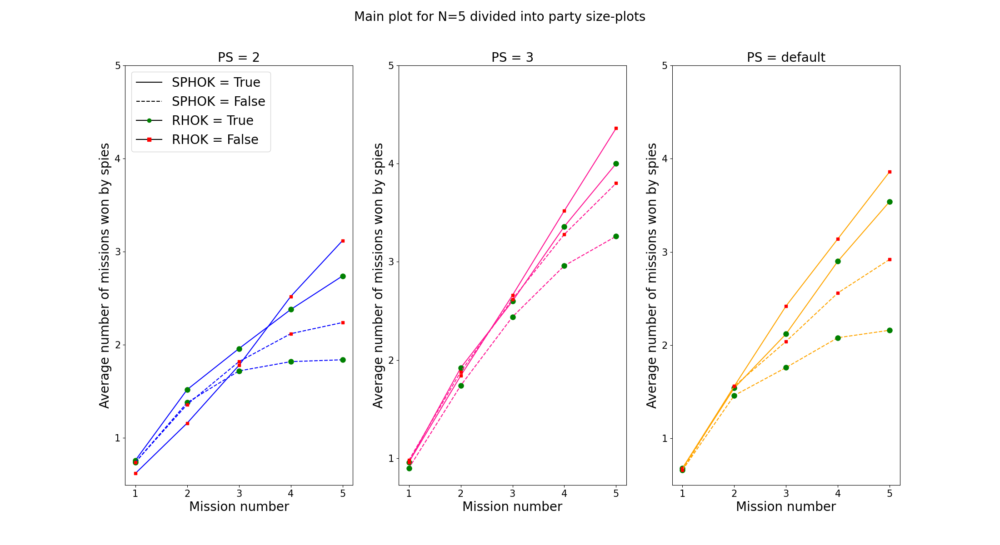
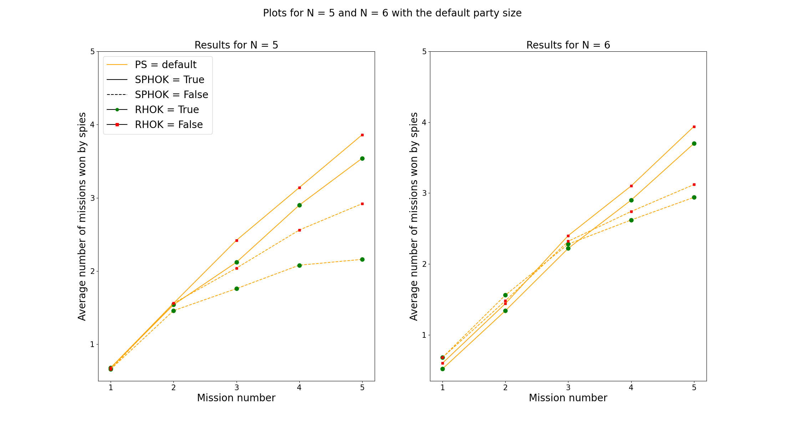

# Modelling the Resistance using Higher Order Knowledge
Authors: Ella Collins, Lonneke Langeveld, and Ritten Roothaert

# Introduction

### The Resistance
For our project, we implemented a multi-agent simulation based on The Resistance. The Resistance is a multiplayer deductive reasoning role-playing game designed by Don Eskridge in 2010. The players are divided into two "factions": the Resistance (the "good guys") and the government spies (the "bad guys"). Within the game, players are sent on 5 missions that can either pass or fail. Both teams work to score at least three points. A minimum of five players is required for the game.

At the start of a game with five players, two players are chosen at random to be spies, and the other three players are the resistance. The spies know each other's identity while the Resistance remains in the dark. After this intitial revelation, the spies are no loner able to comminute privately and thus all comminucation between them has to be public. Each round consists of several elements:
1. A Mission Leader is chosen. The first Mission Leader is chosen randomly - after that, the player to the left of the previous Mission Leader becomes the new Mission Leader.
2. The Mission Leader selects a team to send on the mission. The number of people on the team differs per mission.
3. All players vote on the team composition. If at least half of the players agree with the team composition, the team is sent on a mission. If more than half of the players disagree with the team composition, a new player becomes the Mission Leader and step two and three are repeated. If there are 5 failed attempts to create a mission team, the government spies automatically get one point, and the next round starts.
4. On the mission, each player on the mission team places a card face-down. This card is either a "pass"-card or a "fail"-card. Resistance-players must always play a "pass"-card, whereas spies can choose to play either a "pass"- or "fail"-card. The Resistance wins the mission if all the cards played are "pass"-cards, whereas the spies win if one or more "fail"-cards are played. The faction who wins the mission gets one point.

The winning condition is that one of the teams must win three points (a 'best out of five'-principle). Resistance players have to try to deduce who the spies are, to ensure that the spies cannot sabotage the missions. The spies attempt to keep their identity a secret from the Resistance.

### Our project
With the use of higher-order knowledge, used for reasoning, and public announcements, used to announcement the results of a round, we implemented a multi-agent simulation based on the Resistance. We will describe our simplifications of the game and modifications for the purpose of experimentation under "Theory".

# Theory
## Kripke model
We want to model The Resistance with the help of Dynamic Epistemic Logic. With five players, we have a set of five agents A = {1, 2, 3, 4, 5}. Out of these five agents, two agents are randomly appointed as spies. We denote this as _s<sub>i</sub>_, meaning that agent _i_ is a spy.
The worlds of our Kripke model consist of every possible combination of spy pairs, which, for five agents, results in 10 initial worlds. The initial model is shown below. We have omitted the reflexive relations for clarity. As can be seen from this model, the agents are only aware of their own identity.


As the game proceeds, the model is simplified as the agents learn from the public announcements given at the end of each mission. This public announcement is based on whether a fail-card was played during the mission. We will now give an example of how the game works in terms of updating the Kripke model.

### Example run-through 
We model a game with five agents (A = {1, 2, 3, 4, 5}), where agent 1 and 2 are spies. The rest of the agents are Resistance members. This means that the real world is _s<sub>1</sub>,_ _s<sub>2</sub>_.
As per the rules, the spies are aware of whom the other spies are; thus, agent 1 and 2 are aware of each other's identities. It is also common knowledge that the spies know who the spies are. Resistance members are still only aware of their own identity. This is illustrated in the model below. Note that the model at this stage would be the same regardless of the real world.


The Mission Leader is chosen at random. In this case, agent 4 is the Mission Leader and must propose a mission team.
For mission 1, two players make up the mission team. Since agent 4 has not learnt anything about the identities of the other agents, they choose two players at random for the first mission: agent 1 and agent 5.
Now the other agents must use their knowledge to either vote for or against this mission team. Since none of the Resistance members know of the identity of agent 1 (who is a spy), they will vote _for_ the mission team. This is already a majority for the mission, so the spies' votes are irrelevant. However, in this case they would also vote _for_ the mission, as there is a spy on the mission. This means that the mission team is now accepted, and agent 1 and agent 5 go on the mission.

For this run-through, we simplify the playing of the cards; a spy will always play a fail-card. As such, agent 1 will now play a fail-card (as they are a spy), and agent 5 plays a pass-card (as they are part of the Resistance). Given that one fail-card was played, the mission has failed. This means that the spies now receive one point.
The fact that a fail-card was played can be used to update the knowledge of the agent in the form of a public announcement. The agents know that either agent 1 or agent 5 is a spy. The public announcement made is . The resulting model is shown below:


As can be seen from the updated model, worlds in which neither agent 1 nor agent 5 are spies are removed from the model. From this mission, agent 5 knows that agent 1 played the fail card, since agent 1 was the only other agent on the mission. Therefore, agent 5 knows that agent 1 is a spy. Also, both spies, agent 1 and agent 2, now know that agent 5 knows that agent 1 is a spy.

The next mission leader is chosen as the next player: agent 5. Mission 2 requires a three player team. Since agent 5 knows that agent 1 is a spy, _K<sub>5</sub>s<sub>1</sub>_, they will not include agent 1 in the mission team. Agent 5 does not know anything about the identity of the other players, so they choose three players from the remaining randomly. The proposed team is agent 3, agent 4 and agent 5.
Since agents 1 and 2 know that agents 3, 4 and 5 are all part of the Resistance, they will both vote against this mission team (as the Resistance will figure out who the spies are, as only pass-cards will be played).
However, agents 3, 4, and 5 will vote for this mission team as they do not know that any of the other agents in the team are spies. This leads to a majority for the mission team, so the mission goes ahead.

On mission 2, agents 3, 4, and 5 all play a pass card as they are all part of the Resistance. This means that the mission passes, and the Resistance receives one point. The success of the mission leads to the conclusion that agent 3, agent 4 and agent 5 are not spies. Therefore, the public announcement made is 


This public announcement drastically reduces the model. The worlds with _s<sub>3</sub>_, _s<sub>4</sub>_ or _s<sub>5</sub>_ are removed. This model is illustrated below. 


As can be seen, the only world that is left is the real state of the model, _s<sub>1</sub>, s<sub>2</sub>_. This means that all agents are aware of the real state of the world, and the Resistance players have figured out the identity of the spies. In this example, after only two missions the goal has been reached. All agents know the identity of all the other agents. 

The Resistance will win this game. They will vote against a mission team including spies and only propose mission teams exclusively consisting of resistance agents. Therefore, after 5 missions the score will be resistance: 4, spies: 1.
  
## Our program and implementation
  We use Python to build the simulation of The Resistance. We use Python's library [mesa](https://github.com/projectmesa/mesa) for the agent-based modelling and the [mlsolver](https://github.com/erohkohl/mlsolver) (modal logic solver) library for building, maintaining, and updating our Kripke model.

## Epistemic logic
  There are two different types of agent in this game: Resistance members and spies. The epistemic logic differs for these agents. We have given some introduction into the epistemic logic in the example run-through of the game; we will elaborate more here.
  
  At the beginning of the game, it is basically "no one knows anything". Once the spies know who the spies are, this knowledge updates, such that it becomes common knowledge that the spies know the identity of both spies. However, it is impossible for the resistance agents to deduce who the spies are at this moment. We will look at the different rounds of the game (as described in the Introduction), and see how epistemic logic can be used.
  
  - **Choosing the Mission Leader**: No epistemic logic is used in this case. The first Mission Leader is chosen at random, and after that, the Mission Leader is rotated.
  - **Team selection**: In the selection of the teams, it matters whether the Mission Leader is a Resistance member or a spy.
    - **Resistance**: a resistance agent does not want to send a spy on a mission, as this can cause the mission to fail. Using the Kripke model, we determine whether the agent knows the identity of one or both of the spies. If they do know a spy's identity, the agent will avoid choosing this agent for the team. To form the team, the agent will choose themselves, as they know their own identity, and any agent they are not certain is a spy.
    - **Spy**: a spy aims to sabotage the mission. This means a spy wants to choose a mission team that will not be voted down by the rest of the agents. Therefore, the spy must determine whether the identity of a spy has been revealed to any of the agents, whether the spy knows that another agent knows a spy. This is done using the Kripke model. If one spy's identity is known by an agent, the mission leader chooses the other spy for the mission and randomly fills the rest of the mission with resistance agents. If both identities are known, the team leader randomly chooses a spy for the mission, as they do not want to end up with a mission consisting of only resistance agents.
  - **Vote on the team make-up**: Each agent casts a vote. Again, it is important whether an agent is a Resistance member or a spy.
    - **Resistance**: A Resistance member will agree with a team composition when there are no spies on the team. We determine this by checking whether _K<sub>a</sub>s<sub>b</sub>_ is true, where _a_ is the Resistance agent deciding on the vote, and _b_ is the agent that _a_ is considering for the mission team.
      If _K<sub>a</sub>s<sub>b</sub>_ is true for any agent _b_ in the mission team, the Resistance agent _a_ will vote _against_ this mission. If _K<sub>a</sub>s<sub>b</sub>_ is not true for all agents _b_ in the mission team, the Resistance agent votes _for_ the mission team.
    - **Spy**: The spies always want at least one of the spies to be on the mission. Therefore, the spies vote against team compositions without any spies in them. If there is a spy within the team, they vote in favour.
  - **Playing the cards**: The card played by an agent is dependent on whether the agent is a spy or Resistance member.
    - **Resistance**: a Resistance agent will always play a pass-card
    - **Spy**: the card played by a spy depends on whether the spies are using epistemic logic to make their decision.
      - Without epistemic logic: the spies will always play a fail-card.
      - With epistemic logic: the spies will determine whether playing a fail-card will result in the identity of both spies being revealed. If this is the case, they will choose to play a pass-card to prevent the identities from being revealed. Otherwise, they will play a fail-card.
  - **Updating knowledge**: Firstly, a public announcement is made to all the agents about the result of the mission. This is used to update the Kripke model to reflect the knowledge gained from the announcement. Secondly, the Resistance agents can use the result of the mission and the voting round to reason about the identity of the spies. 
    - **Public announcement**: The public announcement removes worlds that are no longer possible given the results of the mission. The public announcement made depends on the cards played by the agents on the mission.
      - Only fail cards: this means that only spies were on the mission. Therefore, the announcement would be that the agents on the mission are spies. 
      - One fail card and pass cards: this means that one spy was on the mission. The announcement would be that one of the agents one the mission is a spy. 
      - Two fail cards and one or more pass cards: this means that two spies were on the mission with one or more resistance members. The announcement here would be that two of the agents on the mission are spies. 
      - Only pass cards: the announcement for this situation depends on whether the spies are using epistemic logic (as explained above) to choose the card they play. With reasoning spies, nothing can be determined on a passed mission as the spies can play pass-cards to avoid detection. With non-reasoning spies, the announcement would be that all agents on the mission are not spies.
    - **Resistance reasoning**: The resistance agents can reflect on who voted for a mission that failed. For a mission to be sabotaged, a spy must be on the mission. If there are any agents that know the identity of the spy on the mission, they would vote against that mission. Therefore, a resistance agent can use that information to learn the idenity of a fellow resistance agent, which can help them weed out the identity of the spies. This involves updating the Kripke model with an announcement based on the knowledge of the agent.

## Experiments
  We run several experiments, where we vary different parameters: 

  1. **Number of players (N)**: There are two possibilities for this parameter, namely 5 players or 6 players. In either case, there are only two spies, as the rules of the game state that the number of spies is a third of the total number of players rounded up. We want to vary this as we are interested in seeing how the extra Resistance member influences the knowledge and overall gameplay.

  2. **Spies use higher order knowledge for card playing (SPHOK)**: As an important aspect of this project is using higher order knowledge, we wanted to implement this to allow spies to consider between playing a pass-card or a fail-card. We will compare the spies using higher order knowledge with the spies always playing a fail-card as we want to see how knowledge influences the outcome of the game. The spies always playing a fail-card leads to the mission failing, which in turn gives away information on the identity of the spies. In the version where spies reason about whether to play a fail-card, spies try to find out whether playing a fail-card would cause a Resistance agent to be sure of the identity of the spy. If this is the case, a spy plays a pass-card and otherwise they play a fail-card.

  3. **Resistance uses higher order knowledge (RHOK)**: We also wanted to implement some additional higher order knowledge for the resistance agents. As explained prevously, the resistance agents can use the outcome of the voting round of a failed mission to try to determine the identity of the spies.

  4. **Party sizes (PS)**: The rules of the game state that for 5 players the party sizes for the 5 missions are [2, 3, 2, 3, 3]. We are interested in seeing whether changing the party sizes has any influence on the outcome of the game. Therefore, we decided to also include the party sizes [2, 2, 2, 2, 2] and [3, 3, 3, 3, 3] for the 5 missions. For 6 players the party sizes are [2, 3, 4, 3, 4], which we did not vary.
  
  For N=5, we ran every possible combination of parameter values. For N=6, we decided not to vary the party sizes as our the additional party member increased the computational complexity substantially. This allowed us to do more runs with varying the higher order knowledge use of the agents. 
  
  We ran the simulation for each setting 50 times to retrieve an average performance for the agents. From our experiments we measured the following: 
  1. The round in which the identity of the spies is clear (revealed) to all Resistance agents.
  2. Which rounds are won by the spies. This allows us to see how many ronuds are won by the spies over the enitre course of the game

# Results

## Identity revealed
For 5 players (N=5), the table below shows the average mission number in which the idenity of both spies was revealed to all resistance agents. We also count the number of times (out of 50) that the identity of the spies was revealed and the number of times it was not revealed to the resisitance agents to better understand the influence of the different parameters. As can be seen in the table, the use of higher order knowledge by the spies (SPHOK) drastically increases the odds of the spies not being revealed to the Resistance. With the resistance using higher order knowledge (RHOK) it there is a slight decrease in the amount of times the spies are not revealed. Interestingly, with party sizes (PS) of 3 for every mission the spies are more easily revealed while both SPHOK and RHOK are true. This is because there are less instances of the spies not being revealed and on average they are revealed in an earlier mission. Overall, we can see that with both SPHOK and RHOK being true, the identity of the spies are more frequently discerned compared to when only SPHOK is true.

Looking at the results for when spies are not using higher order knowledge (SPHOK is false), we can see that the identities of the spies are revealed quite frequently and, on average, in either the third of fourth mission. With a party size (PS) of 3 for every mission, the identity of the spies remains a secret from the Resistance for longer, for both resistance agents using higher order knowledge (RHOK) or not. We can also see that when RHOK is true the resistance agents are able to learn the identities of the spies more frequently than when RHOK is false.

| SPHOK   | RHOK   | PS   | revealed |   not revealed |   average | rounded average |
|:--------|:-------|:-----|---------:|---------------:|----------:|----------------:|
| True    | True   | 2    |        12|             38 |   4.75    | 5               |
| True    | True   | def  |         7|             43 |   5       | 5               |
| True    | True   | 3    |        14|             36 |   3.71429 | 3.5             |
| True    | False  | 2    |         6|             44 |   5       | 5               |
| True    | False  | def  |         6|             44 |   5       | 5               |
| True    | False  | 3    |         4|             46 |   4.5     | 4.5             | 
| False   | True   | 2    |        49|              1 |   3.4898  | 3.5             | 
| False   | True   | def  |        47|              3 |   3.3617  | 3.5             |
| False   | True   | 3    |        37|             13 |   3.51351 | 3.5             |
| False   | False  | 2    |        48|              2 |   3.83333 | 4               |
| False   | False  | def  |        35|             15 |   3.62857 | 3.5             |
| False   | False  | 3    |        29|             21 |   3.51724 | 3.5             |

For 6 players (N=6), the table below shows the average mission number in which the identity of both spies was revealed to all Resistance agents, the number of times (out of 50) that the identity of the spies was revealed and the number of times it was not revealed. As mentioned previously, we only looked at the effect of higher order knowledge used by the spies and the resistance agents on the performance with the default party sizes for 6 agents. 

Here we can see that influence of the spies using higher order knowledge (SPHOK) substrantially increases the odds of the spies not being revealed to the Resistance. Also, it seems that when the spies are revealed it is in one of the last missions of the game, mission 4 or 5. Resistance agents using higher order knowledge (RHOK) seems to have little effect on their performance regardless of the whether the spies are using higher order knowledge (SPHOK). 

Comapring the results of 6 players with those of 5 players with the default party sizes (PS), we can see that with SPHOK as true, there seems to be little difference in the amount of times the spies are revealed but, there is a difference in when they were revealed. For 5 players, the average mission number for when the spies were revealed is 5, whereas for 6 players it is around 4.5. This suggests that with 6 players the resistance agents are faster at discerning the identity of the spies. Looking at the difference between 5 and 6 players when SPHOK is false, we can see that with resistance agents using higher order knowlege (RHOK), the spies are revealed very easily for 5 players. However, this is not the case with 6 players. When RHOK is false there seems to be little difference in performance between 5 players and 6 players.

| SPHOK   | RHOK   | revealed |   not revealed |   average | rounded average |
|:--------|:-------|---------:|---------------:|----------:|----------------:|
| True    | True   |         5|             45 |   4.4     | 4.5             |
| True    | False  |         4|             46 |   4.5     | 4.5             |
| False   | True   |        35|             15 |   3.85714 | 4               |
| False   | False  |        31|             19 |   3.77419 | 4               |

## Rounds won by the spies
In the graph below we can see the mission number against the average number of missions won by the spies for 5 players. We split this graph up into three subgraphs, one for each variant of the party size (PS), to increase readability. Firstly, we can easily see that with a PS of 2 for each mission, the spies receive less points than the other conditions. Also, a PS of 3 for each mission, seems to be the optimum for the spies. 

Regardless of the PS, the spies receive the most points when they are using higher order knowledge (SPHOK is true) and the resistance agents are not (RHOK is false). Additionally, when the resistance agents are using higher order knowledge (RHOK is true), the performance of the spies decreases.  


The graph below shows a comparison between the results for 5 players and 6 players, both with the default party size. For both conditions it seems that there is little difference when the spies are using higher order knowledge (SPHOK), regardless of whether the resistance agents are using higher order knowledge (RHOK). We do see a small difference between 5 players and 6 players when looking at SPHOK is false. For 5 players the spies receive less points on average than for 6 players. These resutls were also reflected in the tables explained above.



# Conclusion
Our main finding is that higher-order knowledge, be it for the spies or the resistance, really does make a difference in playing the game.
When the spies reason with higher-order knowledge, they always perform better (i.e. win more missions) than when they do not use higher-order knowledge. The same goes for the Resistance players. When an agent reasons with higher-order knowledge, they utitlize more information in making their decisions. It would make sense that having more information leads to making a better decision. Therefore, the results we have are compliant with what one would expect.

This effect does seem to be stronger for spies. There is a clear difference in how often spies are found out when they do or do not use higher-order knowledge. The difference in when the Resistance members use higher-order knowledge or not seems to be much smaller.

We can also draw conclusions from the other parameters. Looking at the party sizes, we can see that with smaller party sizes the spies are more easily identified if they are not using higher order knowledge. In this case, the spies always play a fail-card, which would immediately reveal their identity to the resistance agent on the mission with them. When the party size is larger and a fail-card is played, the Resistance has less information to work with, as one out of three (instead of one out of two) of the members on the mission is a spy.
We also see that, in general, a smaller party size translates to the spies winning fewer missions, and therefore fewer games.

Lastly, we find that the use of higher-order knowledge for Resistance members has much more effect in a 5-agent game than in a 6-agent game. In a 5-agent game, there are 2 spies and 3 Resistance members; in a 6-agent game, the added agent is a Resistance member. The Resistance members therefore have a larger chance of winning in a 6-agent game than in a 5-agent game. Therefore, using higher-order knowledge in a 5-agent game has a larger effect than in a 6-agent game.


<!--- Markdown is a lightweight and easy-to-use syntax for styling your writing. It includes conventions for
In the case of a Resistance agent, you do not want to send a spy on a mission, as this will likely cause your mission to fail (depending on whether or not the spy plays a fail-card). The Resistance agent will thus put together a team in which no spies are present.

```markdown
Syntax highlighted code block

# Header 1
## Header 2
### Header 3

- Bulleted
- List

1. Numbered
2. List

**Bold** and _Italic_ and `Code` text

[Link](url) and 
```

For more details see [GitHub Flavored Markdown](https://guides.github.com/features/mastering-markdown/).

### Jekyll Themes

Your Pages site will use the layout and styles from the Jekyll theme you have selected in your [repository settings](https://github.com/Ritten11/LAMAS2021/settings/pages). The name of this theme is saved in the Jekyll `_config.yml` configuration file.

### Support or Contact

Having trouble with Pages? Check out our [documentation](https://docs.github.com/categories/github-pages-basics/) or [contact support](https://support.github.com/contact) and we’ll help you sort it out.
-->
